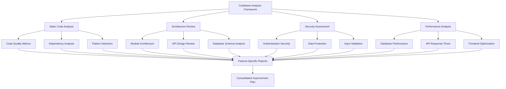
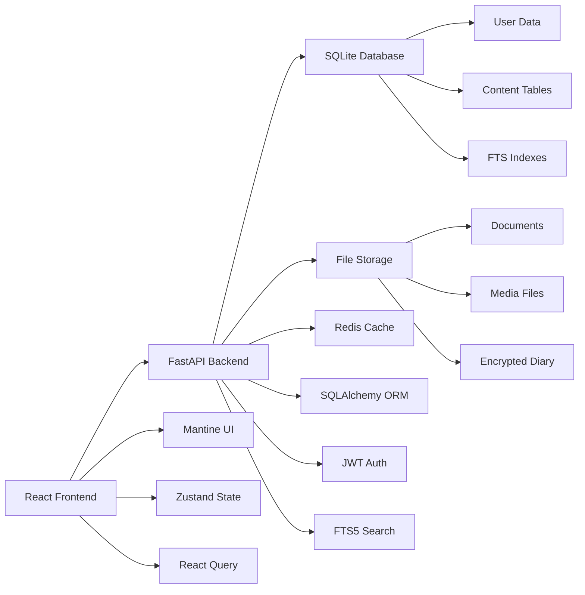

# Design Document - PKMS Codebase Analysis & Improvement

## Overview

This design document outlines a comprehensive approach to analyze the PKMS (Personal Knowledge Management System) codebase, identify issues, and create actionable improvement recommendations. The analysis will be systematic, feature-focused, and produce detailed documentation for each major component of the system.

## Architecture

### Analysis Framework Architecture



### System Architecture Overview

Based on the codebase examination, the PKMS system follows this architecture:



## Components and Interfaces

### 1. Analysis Engine Components

#### Code Quality Analyzer
- **Purpose**: Evaluate code quality, patterns, and maintainability
- **Input**: Source code files, configuration files
- **Output**: Quality metrics, pattern analysis, technical debt assessment
- **Methods**:
  - Static analysis of TypeScript/Python code
  - Dependency vulnerability scanning
  - Code duplication detection
  - Complexity metrics calculation

#### Architecture Reviewer
- **Purpose**: Assess system architecture and design patterns
- **Input**: Module structure, API definitions, database schemas
- **Output**: Architecture assessment, design pattern analysis
- **Methods**:
  - Module dependency analysis
  - API design review
  - Database schema evaluation
  - Cross-cutting concern identification

#### Security Assessor
- **Purpose**: Identify security vulnerabilities and compliance gaps
- **Input**: Authentication code, API endpoints, data handling
- **Output**: Security vulnerability report, compliance checklist
- **Methods**:
  - Authentication flow analysis
  - Input validation review
  - Data encryption assessment
  - OWASP compliance check

#### Performance Analyzer
- **Purpose**: Identify performance bottlenecks and optimization opportunities
- **Input**: Database queries, API endpoints, frontend components
- **Output**: Performance metrics, optimization recommendations
- **Methods**:
  - Query performance analysis
  - Bundle size analysis
  - Rendering performance review
  - Caching strategy evaluation

### 2. Feature Analysis Components

Each major feature will be analyzed using these standardized components:

#### Frontend Component Analysis
- Component structure and patterns
- State management implementation
- Performance characteristics
- User experience assessment

#### Backend Service Analysis
- API endpoint design
- Business logic implementation
- Database interaction patterns
- Error handling strategies

#### Integration Analysis
- Frontend-backend communication
- Data flow patterns
- Error propagation
- State synchronization

## Data Models

### Analysis Result Schema

```typescript
interface AnalysisResult {
  feature: string;
  category: 'frontend' | 'backend' | 'integration' | 'infrastructure';
  severity: 'critical' | 'high' | 'medium' | 'low';
  type: 'security' | 'performance' | 'maintainability' | 'functionality';
  description: string;
  impact: string;
  recommendation: string;
  effort: 'low' | 'medium' | 'high';
  files: string[];
  codeExamples?: {
    current: string;
    improved: string;
  };
}
```

### Feature Analysis Schema

```typescript
interface FeatureAnalysis {
  name: string;
  description: string;
  currentImplementation: {
    frontend: ComponentAnalysis[];
    backend: ServiceAnalysis[];
    database: SchemaAnalysis[];
  };
  issues: AnalysisResult[];
  improvements: ImprovementRecommendation[];
  technicalDebt: TechnicalDebtItem[];
  securityConcerns: SecurityIssue[];
  performanceIssues: PerformanceIssue[];
}
```

## Error Handling

### Analysis Error Categories

1. **File Access Errors**
   - Missing files or directories
   - Permission issues
   - Corrupted files

2. **Parsing Errors**
   - Syntax errors in source files
   - Invalid configuration formats
   - Malformed schemas

3. **Analysis Errors**
   - Tool execution failures
   - Dependency resolution issues
   - Resource constraints

### Error Recovery Strategies

- **Graceful Degradation**: Continue analysis with available data
- **Alternative Methods**: Use backup analysis techniques
- **Partial Results**: Report findings from successful components
- **Error Reporting**: Document failed analysis attempts

## Testing Strategy

### Analysis Validation

1. **Sample Code Testing**
   - Create known problematic code samples
   - Verify analysis tools detect expected issues
   - Validate recommendation accuracy

2. **Cross-Validation**
   - Compare results from multiple analysis methods
   - Verify consistency across different tools
   - Manual review of critical findings

3. **Improvement Verification**
   - Test recommended changes in isolated environment
   - Measure impact of suggested improvements
   - Validate security enhancements

### Quality Assurance

1. **Report Accuracy**
   - Verify all identified issues are real
   - Ensure recommendations are actionable
   - Check for false positives

2. **Completeness Check**
   - Ensure all major components are analyzed
   - Verify no critical areas are missed
   - Cross-reference with requirements

## Implementation Approach

### Phase 1: Infrastructure Analysis
- Database schema and performance
- Configuration and deployment setup
- Security infrastructure review
- Dependency and version analysis

### Phase 2: Core Feature Analysis
- Authentication and authorization system
- Notes management module
- Document handling system
- Search functionality implementation

### Phase 3: Secondary Feature Analysis
- Todo management system
- Diary module with encryption
- Archive organization system
- Dashboard and reporting

### Phase 4: Integration Analysis
- Frontend-backend communication
- State management patterns
- Error handling consistency
- Performance optimization opportunities

### Phase 5: Consolidation and Prioritization
- Aggregate findings across all features
- Prioritize issues by impact and effort
- Create implementation roadmap
- Generate executive summary

## Analysis Tools and Methods

### Static Analysis Tools
- **ESLint/TSLint**: TypeScript code quality
- **Bandit**: Python security analysis
- **SonarQube**: Code quality metrics
- **npm audit**: Dependency vulnerability scanning

### Performance Analysis
- **Lighthouse**: Frontend performance metrics
- **SQLite EXPLAIN**: Query performance analysis
- **Bundle Analyzer**: JavaScript bundle optimization
- **Memory Profiling**: Resource usage analysis

### Security Analysis
- **OWASP ZAP**: Security vulnerability scanning
- **Semgrep**: Security pattern detection
- **Safety**: Python dependency security
- **Manual Code Review**: Authentication flow analysis

## Deliverables Structure

### 1. Executive Summary Document
- High-level findings and recommendations
- Priority matrix of issues
- Resource requirements for improvements
- Timeline for implementation

### 2. Feature-Specific Analysis Reports
- Detailed analysis for each major feature
- Current implementation assessment
- Specific improvement recommendations
- Code examples and migration guides

### 3. Technical Debt Assessment
- Quantified technical debt metrics
- Refactoring priorities and strategies
- Long-term maintenance recommendations
- Architecture evolution roadmap

### 4. Security Assessment Report
- Comprehensive security vulnerability analysis
- Compliance gap assessment
- Security improvement roadmap
- Implementation guidelines

### 5. Performance Optimization Guide
- Performance bottleneck identification
- Optimization recommendations with expected impact
- Monitoring and measurement strategies
- Scalability considerations

## Success Metrics

### Analysis Quality Metrics
- **Coverage**: Percentage of codebase analyzed
- **Accuracy**: Ratio of valid issues to false positives
- **Completeness**: All major components covered
- **Actionability**: Percentage of recommendations with clear implementation steps

### Improvement Impact Metrics
- **Security**: Number of vulnerabilities addressed
- **Performance**: Measurable performance improvements
- **Maintainability**: Reduced code complexity metrics
- **Developer Experience**: Improved development workflow efficiency

## Risk Mitigation

### Analysis Risks
- **Incomplete Analysis**: Mitigated by systematic coverage verification
- **False Positives**: Addressed through manual validation
- **Tool Limitations**: Compensated with multiple analysis methods
- **Resource Constraints**: Managed through phased approach

### Implementation Risks
- **Breaking Changes**: Mitigated by thorough testing recommendations
- **Performance Regression**: Addressed through benchmarking
- **Security Vulnerabilities**: Prevented through security-first approach
- **Development Disruption**: Minimized through incremental improvements